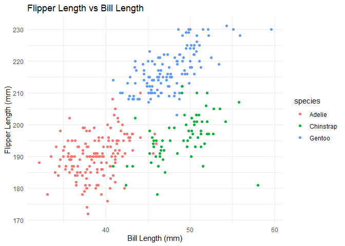

p8105_hw1_cm3341
================
Carolina Montes Garcia
2024-09-17

- [Problem 1](#problem-1)
  - [Scatterplot of flipper length vs. bill
    length](#scatterplot-of-flipper-length-vs-bill-length)
- [Problem 2](#problem-2)

Load tidyverse for its functions, tidy syntax, tibbles, and because it
includes ggplot2

``` r
library(tidyverse)
```

    ## ── Attaching core tidyverse packages ──────────────────────── tidyverse 2.0.0 ──
    ## ✔ dplyr     1.1.4     ✔ readr     2.1.5
    ## ✔ forcats   1.0.0     ✔ stringr   1.5.1
    ## ✔ ggplot2   3.5.1     ✔ tibble    3.2.1
    ## ✔ lubridate 1.9.3     ✔ tidyr     1.3.1
    ## ✔ purrr     1.0.2     
    ## ── Conflicts ────────────────────────────────────────── tidyverse_conflicts() ──
    ## ✖ dplyr::filter() masks stats::filter()
    ## ✖ dplyr::lag()    masks stats::lag()
    ## ℹ Use the conflicted package (<http://conflicted.r-lib.org/>) to force all conflicts to become errors

## Problem 1

The ‘penguins’ dataset includes 344 entries of bill measurements,
flipper measurements, body mass in grams, sex, and the year of
measurement for three different species of penguin - Adelie, Chinstrap,
and Gentoo.

``` r
data("penguins", package = "palmerpenguins")

dataset_size = penguins %>%
  summarise(rows = n(), columns = ncol(penguins))

dataset_size
```

    ## # A tibble: 1 × 2
    ##    rows columns
    ##   <int>   <int>
    ## 1   344       8

``` r
mean_flipper_length = penguins %>%
  summarise(mean_flipper_length_mm = mean(flipper_length_mm, na.rm = TRUE))

mean_flipper_length
```

    ## # A tibble: 1 × 1
    ##   mean_flipper_length_mm
    ##                    <dbl>
    ## 1                   201.

### Scatterplot of flipper length vs. bill length

``` r
ggplot(
  penguins, aes(
    x = bill_length_mm, 
    y = flipper_length_mm, 
    color = species)) +
  geom_point() +
  labs(
    title = "Flipper Length vs Bill Length", x = "Bill Length (mm)", y = "Flipper Length (mm)") +
  theme_minimal()
```

    ## Warning: Removed 2 rows containing missing values or values outside the scale range
    ## (`geom_point()`).

<!-- -->

``` r
ggsave("flipper_vs_bill_length.png")
```

    ## Saving 7 x 5 in image

    ## Warning: Removed 2 rows containing missing values or values outside the scale range
    ## (`geom_point()`).

## Problem 2

Set seed for reproducibility purposes

``` r
set.seed(123)
```

Create dataframe

``` r
example_data = data.frame(
  normal_sample = rnorm(10),
  greater_than_zero = rnorm(10) > 0,
  char_vector = letters[1:10],
  factor_vector = factor(sample(c("fun level", "ugly level", "evil level"), 10, replace = TRUE))
)
```

Mean of each dataframe variable
